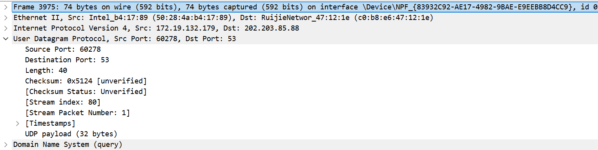
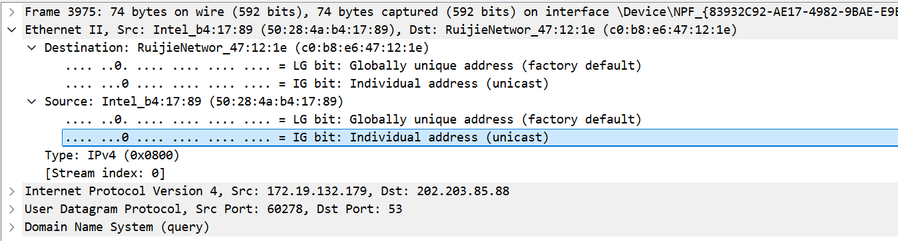
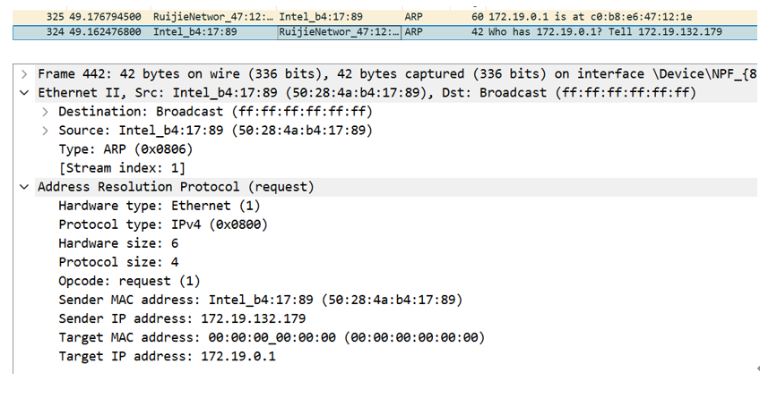
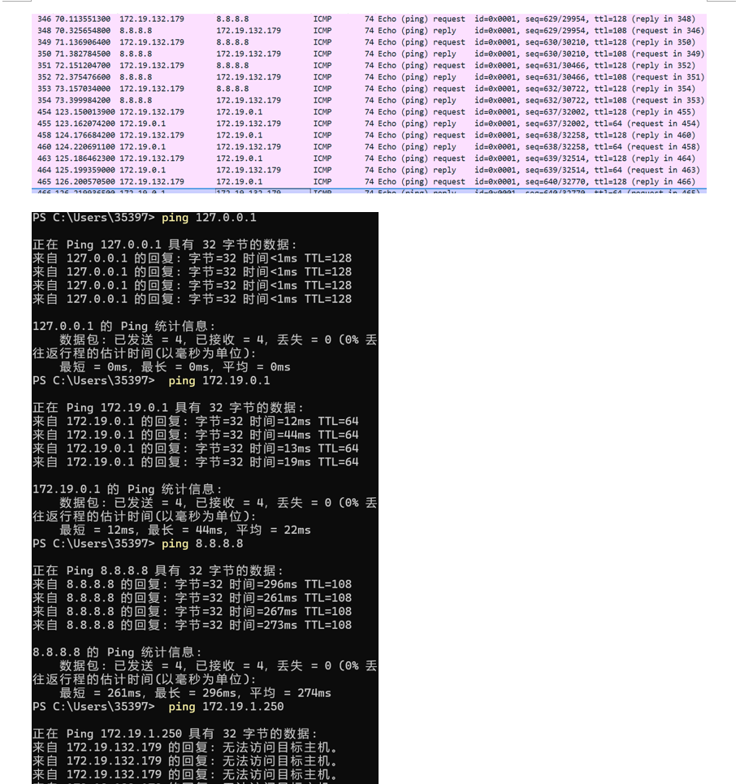

# Lab5：IP 与以太网的包收发操作

## 实验背景

本实验围绕 IP 模块与以太网在包收发过程中的角色展开，重点观察以下内容：

1. 网络包的基本结构：头部（IP 头部 + MAC 头部）与数据
2. IP 头部各字段的含义：版本号、TTL、协议号、发送方/接收方 IP 地址等
3. MAC 头部各字段的含义：接收方/发送方 MAC 地址、以太类型
4. IP 地址与 MAC 地址的区别与协作
5. ARP 协议如何通过 IP 地址查询 MAC 地址
6. 路由表的结构与查询方式
7. UDP 协议与 TCP 协议的区别：无连接、无确认、无重传
8. UDP 头部结构：发送方端口号、接收方端口号、数据长度、校验和
9. ICMP 协议的作用与常见消息类型（Echo、Destination Unreachable 等）

---

## 实验任务

### 任务一：查看路由表、ARP 缓存并启动 Wireshark

**第一步：打开 Wireshark，选择主网络接口，开始抓包**

> **注意**：本次实验必须使用真实网络接口（`en0`/`eth0`/`以太网`），不要选回环接口。回环接口不经过以太网，无法观察到 MAC 头部和 ARP 过程。

选择你的主网络接口，开始抓包。本次实验的大部分任务会共用同一次抓包。

**第二步：查看本机路由表**

```bash
# Linux
route -n
ip route show

# macOS
netstat -rn

# Windows
route print
```

截图并保存为 `route_table.png`。

**第三步：查看本机 ARP 缓存**

```bash
# Linux / macOS / Windows
arp -a
```

截图并保存为 `arp_cache.png`。

**第四步：填写下表**

从路由表和 ARP 缓存的输出中提取信息：

| 项目                         | 你的填写内容 |
| :--------------------------- | :----------- |
| 本机 IP 地址                 | 172.19.132.179             |
| 本机所在子网                 |  172.19.0.0            |
| 子网掩码                     | 255.255.0.0             |
| 默认网关 IP                  | 172.19.0.1             |
| 默认网关 MAC 地址            |    c0:b8:e6:47:12:1e          |
| 本机网卡 MAC 地址            |  50:28:4a:b4:17:89            |

简答题：

1. 路由表的每一行包含哪些关键字段？教材中提到的 `Network Destination`、`Netmask`、`Gateway`、`Interface` 分别对应什么含义？

答：包含网络目标、网络掩码、网关、接口、跃点数等关键字段。
Network Destination（网络目标）：表示数据包的目标网络或目标主机的 IP 地址。

Netmask（网络掩码）：用于与目标 IP 地址进行按位与运算，以判断是否与该网络目标匹配。

Gateway（网关）：数据包的下一跳路由器 IP 地址；如果在同一局域网（即不需要经过路由器），通常显示为“在链路上”（On-link）。

Interface（接口）：本机用于发送该数据包的网卡所对应的 IP 地址。

2. 当目标 IP 地址不在本子网时，包会先发给谁？路由表的哪一列提供了这个信息？

答： 包会先发给默认网关（即本地局域网连接的路由器）。路由表中的 Gateway（网关）一列提供了这个信息。

3. 路由表的默认网关（`0.0.0.0`）条目的作用是什么？什么时候会匹配到这一行？

答： 0.0.0.0 作为默认路由，起到了“兜底”的作用。当要发送的数据包的目标 IP 地址无法与路由表中任何其他具体的子网或主机条目匹配成功时，就会匹配到这一行，将数据包统一交给默认网关去外网寻找路径。

4. 教材提到，确定发送方 IP 地址的关键在于"判断应该使用哪块网卡"。结合你查到的本机网卡信息，说明 IP 模块是如何做出这个判断的。

答： IP 模块通过查询操作系统的路由表做出判断。当 IP 模块收到发送请求时，会将目标 IP 与路由表各条目的子网掩码进行按位与运算。一旦与某个网络目标匹配成功，IP 模块就会查看该条目对应的 Interface（接口）列。该接口列上标记的本机 IP 地址，就决定了系统应当使用分配了该 IP 的具体物理或虚拟网卡来发送数据。


---

### 任务二：观察 UDP 头部

只要计算机处于联网状态，Wireshark 中就会持续出现大量 UDP 流量（DNS、mDNS、DHCP、NTP 等），无需手动生成。

**第一步：在 Wireshark 中设置过滤器**

```text
udp
```

**第二步：在包列表中找一个 UDP 包**

随便选一个即可。如果包太多，可以加上源或目的 IP 来缩小范围，例如 `udp && ip.addr == 你的IP`。如果需要 DNS 包，也可以用 `udp.port == 53` 过滤。

> **可选**：如果想明确看到一个完整的请求-响应对，可以在终端中执行 `nslookup example.com`，Wireshark 中就会出现对应的 DNS 请求包。

**第三步：点击选中的 UDP 包，在详情栏展开 `User Datagram Protocol`**

填写下表：

| 项目               | 你的填写内容 |
| :----------------- | :----------- |
| UDP 头部总长度     |  8字节            |
| 源端口             |        60278      |
| 目的端口           | 53             |
| 长度（Length）     |   40           |
| 校验和（Checksum） |  0x5124            |

简答题：

1. 你观察到的 UDP 头部长度是多少字节？TCP 头部至少 20 字节。UDP 省略了哪些字段？这些字段的缺失带来了什么后果？

答： UDP 头部长度是 8 字节。相比 TCP，UDP 省略了序号、确认号、数据偏移、控制标志位（SYN/ACK等）、窗口大小、紧急指针等字段。缺失这些字段带来的后果是：UDP 无法保证数据传输的可靠性（无确认应答、不重传丢失包），无法保证数据包按序到达，且没有流量控制和拥塞控制机制。

2. UDP 头部中的"长度"字段指的是什么长度？

答： 指的是 UDP 头部加上 UDP 数据载荷的总字节长度。



---

### 任务三：观察 IP 头部字段

点击任务二中的同一个 UDP 包，在详情栏展开 `Internet Protocol Version 4`。

填写下表：

| 字段名称               | 你的填写内容 | 含义说明 |
| :--------------------- | :----------- | :------- |
| Version（版本号）      | 4             |  表示使用的是 IPv4 协议。        |
| Header Length（头部长度） |  20 bytes (5)          |    表示 IP 头部本身的长度（单位为 4 字节，5 乘以 4 为 20 字节），没有可选字段。      |
| Time to Live（TTL）    |  128            |    数据包的生存时间，每经过一个路由器该值减 1，防止数据包在网络中出现无限循环。      |
| Protocol（协议号）     |    UDP (17)          |      标识上层网络层封装的协议类型，17 代表 UDP。    |
| Source Address（源 IP） |   172.19.132.179           |    发送方的逻辑 IP 地址。      |
| Destination Address（目的 IP） |  202.203.85.88      |     最终接收方的逻辑 IP 地址。     |

简答题：

1. 协议号字段的值是多少？它代表什么协议？如果抓一个 HTTP 请求的包，协议号会变成多少？

答： 此包的协议号值是 17，代表 UDP 协议。如果抓取的是 HTTP 请求的包，因为 HTTP 承载在 TCP 之上，协议号会变成 6（代表 TCP 协议）。

2. TTL 字段的作用是什么？如果 TTL 降为 0 会发生什么？

答： TTL 字段用于限制数据包在网络中存活的最大跳数，以防止路由环路导致的无限转发拥塞。如果数据包在传输过程中 TTL 降为 0，当前的路由器就会将该数据包丢弃，并向发送方回传一个 ICMP Time Exceeded（超时）消息。

3. 有教材提到 IP 地址"实际上并不是分配给计算机的，而是分配给网卡的"。你的本机有几块网卡？每块网卡的 IP 地址分别是什么？（提示：可参考任务一中路由表的 Interface 列，或用 `ip addr`（Linux）/`ifconfig`（macOS）/`ipconfig`（Windows）查看。）

答： 根据终端输出（如 route print 和接口列表截图），本机存在多块网络接口（包括 Intel Wi-Fi 网卡、VMware 虚拟网卡、蓝牙设备等）。主 Wi-Fi 网卡的 IP 地址为 172.19.132.179，同时存在回环接口 IP 127.0.0.1 以及 VMware 等虚拟网卡对应的 IP（如 192.168.95.1、192.168.187.1 等）。这验证了 IP 是绑定在具体接口（网卡）而非单一计算机上的。
4. IP 头部中的源 IP 地址和目的 IP 地址分别是谁的地址？它们与 MAC 头部中的源/目的 MAC 地址有什么区别？

答： IP 头部中的地址是端到端通信的最终发送端和接收端的网络层逻辑地址，在整个数据传输路径中通常保持不变。而 MAC 头部中的源/目的 MAC 地址是数据链路层的物理地址，仅在同一个局域网链路中有效；每经过一个路由器跳转时，MAC 头部会被拆解并重新封装，换成当前跳链路两端设备的 MAC 地址。


---

### 任务四：观察 MAC 头部与以太网帧

点击任务二中的同一个 UDP 包，在详情栏展开 `Ethernet II`。

填写下表：

| 字段名称               | 你的填写内容 | 含义说明 |
| :--------------------- | :----------- | :------- |
| Source（源 MAC）       |  50:28:4a:b4:17:89            |     发出此以太网帧的设备的物理地址（本机的 Intel Wi-Fi 网卡）。     |
| Destination（目的 MAC） | c0:b8:e6:47:12:1e             |  接收此以太网帧的相邻设备的物理地址（网关路由器的接口）。        |
| Type（以太类型）       |    IPv4 (0x0800)          |    标识后面承载的数据网络层协议类型是 IPv4。      |

关于 MAC 地址格式，填写下表：

| 项目               | 你的填写内容 |
| :----------------- | :----------- |
| MAC 地址长度       | 48 比特（6 字节） |
| 本机网卡的 MAC 地址 |  50:28:4a:b4:17:89            |
| 目的 MAC 地址      | c0:b8:e6:47:12:1e             |
| MAC 地址的书写格式 | 通常分为 6 组，每组 2 位十六进制数，以冒号(:)或连字符(-)分隔。             |

简答题：

1. 以太类型字段的值是多少？它代表后面承载的是什么协议的包？

答： 值为 0x0800，它代表帧的数据部分承载的是 IPv4 协议包。

2. DNS 服务器的 IP 通常是外网地址。本任务中目的 MAC 地址是 DNS 服务器的 MAC 地址还是你本机网关（路由器）的 MAC 地址？为什么？

答： 是本机网关的 MAC 地址。因为本机的 MAC 地址和以太网通信仅在同一物理局域网段内有效。由于 DNS 服务器（202.203.85.88）在外部网络，数据必须交由局域网内的网关（路由器 172.19.0.1）进行下一跳转发，因此以太网帧的目的 MAC 要填写网关的物理地址。

3. IP 地址和 MAC 地址在功能上有什么相似之处？又有什么本质区别？

答： 相似之处： 二者都是网络中用于标识节点和寻址的标识符。本质区别： MAC 地址是工作在数据链路层的物理地址，由网卡出厂固化，无层次化结构，仅在同一局域网（同一广播域）内用于定位相邻节点；IP 地址是工作在网络层的逻辑地址，具有分层的网络拓扑结构（网络号+主机号），用于跨越多个子网进行端到端的互联网全局路由寻址。

4. 为什么以太网帧中需要同时有 IP 地址（在 IP 头部中）和 MAC 地址？不能只用其中一种吗？


答： 不能。由于网络架构采取分层设计，它们负责不同的任务。如果没有 IP 地址，路由器将无法获知数据包的最终目的地并进行跨网段转发；而在局域网的多址访问环境中，如果没有 MAC 地址，网卡将无法区分共享物理链路上的电信号到底发往哪个具体设备。二者结合构成了“下一跳物理导航”和“最终目的地逻辑导航”。


---

### 任务五：观察 ARP 协议

ARP（Address Resolution Protocol，地址解析协议）用于根据 IP 地址查询 MAC 地址。只要计算机处于联网状态，Wireshark 中通常会持续出现 ARP 包（邻居发现、缓存刷新等），可以直接观察。如果抓包一段时间后仍未看到 ARP 包，再手动触发。

**第一步：在 Wireshark 中设置过滤器**

```text
arp
```

**第二步：在包列表中找 ARP 包**

正常联网的设备每隔几分钟就会自动发送 ARP 请求，等待即可。如果等了一会儿仍没有，可以选择以下任一方式手动触发：

- **方式 A（推荐）**：在终端中执行 `arping`

  ```bash
  # Linux（通常已预装）
  sudo arping -c 3 <网关IP>

  # macOS（如果没有，先执行：brew install arping）
  sudo arping -c 3 <网关IP>

  # Windows（可从 https://github.com/ThomasHabets/arping/releases 下载）
  arping -c 3 <网关IP>
  ```

- **方式 B**：先清除 ARP 缓存，再 ping 同网段地址

  ```bash
  # 清除 ARP 缓存
  # Linux:   sudo ip neigh flush all
  # macOS:   sudo arp -d -a
  # Windows: arp -d *

  # 然后 ping 网关
  ping <网关IP> -c 2
  ```

> **注意**：如果目标是 `127.0.0.1` 或外网地址，ARP 不会出现。回环接口不经过以太网，外网地址的 MAC 地址是路由器的（通常已缓存）。

**第三步：点击 ARP 请求包（Opcode 为 request），展开详情**

**第四步：填写下表**

| 项目                     | 你的填写内容 |
| :----------------------- | :----------- |
| ARP 请求的目的 MAC 地址 | ff:ff:ff:ff:ff:ff (Broadcast)             |
| ARP 请求中查询的目标 IP | 172.19.0.1             |
| ARP 响应中返回的 MAC 地址 |  c0:b8:e6:47:12:1e            |
| 该 ARP 包是自动出现还是手动触发的 |  自动出现（设备在与网关通信前查询缓存，或通过手动清理后抓包获取）。           |

简答题：

1. ARP 请求的目的 MAC 地址为什么是 `ff:ff:ff:ff:ff:ff`（广播地址）？

答： 因为在发送 ARP 请求时，发送方只知道目标设备的 IP，还不知道其 MAC 地址，所以必须使用局域网广播地址。这样一来，同一链路上的所有网卡都能接收到这个帧，进而交给各自系统的 ARP 模块处理，拥有该 IP 的设备就会出声回应。

2. 为什么 ARP 缓存中的条目会在几分钟后自动删除？

答： 为了适应网络拓扑的动态变化。如果某台主机的 IP 地址被重新分配，或者更换了网卡（MAC地址改变），永久保留的旧缓存会导致数据包发往错误的物理地址。设置过期时间可以强制设备定期更新映射关系。
3. 如果 ARP 缓存中的 MAC 地址已经过期（对方 IP 对应的设备已更换），会出现什么问题？如何解决？

答： 发送方会将数据包发送到旧的 MAC 地址，由于对应的设备已不在该链路或已被更换，包无法被新设备接收，导致通信丢包或中断。解决方法：系统等待 ARP 缓存超时后自动刷新，或者管理员通过命令行（如 arp -d *）强制清除本机的 ARP 缓存表，重新触发 ARP 广播请求。



---

### 任务六：使用 `ping` 命令观察 ICMP

有教材提到了 ICMP（Internet Control Message Protocol）协议，它用于在 IP 层传递错误和控制信息。`ping` 命令就是基于 ICMP 的 Echo Request（类型 8）和 Echo Reply（类型 0）实现的。

**第一步：在 Wireshark 中设置 ICMP 过滤器**

```text
icmp
```

**第二步：在终端中执行 ping 命令**

```bash
# ping 本机（回环）
ping 127.0.0.1 -c 4

# ping 局域网内的设备（如路由器网关）
ping <网关IP> -c 4

# ping 外网地址
ping 8.8.8.8 -c 4
```

**第三步：在 Wireshark 中观察 ICMP 包**

填写下表：

| 目标               | 是否收到回复 | 往返时间（ms） | TTL 值 |
| :----------------- | :----------- | :------------- | :----- |
| 127.0.0.1          |    是          |   <1ms (0ms)             |    128    |
| 局域网设备（网关） |    是          |     平均 22ms           |    64    |
| 8.8.8.8            |    是          |      平均 274ms          |    108    |

> **提示**：ping 回环地址（`127.0.0.1`）时数据不经过物理网卡，Wireshark 在主网络接口上可能无法捕获到包。TTL 值可从终端输出中读取（`ping` 会显示 `ttl=...`），或切换 Wireshark 至回环接口（`lo0` / `lo`）抓包。

简答题：

1. `ping` 命令发送的是什么类型的 ICMP 消息？收到的回复又是什么类型？

答： 发送的是 ICMP Echo Request（回显请求，类型 8）；收到的是 ICMP Echo Reply（回显应答，类型 0）。

2. 为什么 ping 不同目标的 TTL 值不同？TTL 值反映了什么信息？

答： TTL 的初始值因不同操作系统的设置而异（常见如 64、128 或 255）。我们在终端看到的 TTL 值是目标设备发出响应包并在到达本机时剩余的值。它反映了应答包返回途中经过了多少个路由器的转发跳数（初始值减去接收值即等于经过的路由跳数）。

3. 教材表 2.4 中列出了多种 ICMP 消息类型。`Destination unreachable`（类型 3）在什么情况下会出现？请用以下方法尝试触发并观察：

   ```bash
   # 方法一（推荐）：ping 同网段内一个确认不存在的 IP
   # 例如你的本机 IP 是 192.168.1.100，子网掩码 255.255.255.0，
   # 那么可以 ping 192.168.1.250（一个大概率没有被分配的地址）
   ping <同网段不存在的IP> -c 3
   
   # 方法二：向一个关闭的端口发 UDP 包，触发 ICMP Port Unreachable
   # 先在 Wireshark 中保持 icmp 过滤器，然后执行：
   # Linux / macOS
   echo "test" | nc -u -w 1 <同网段某台设备的IP> 19999
   
   # Windows（需安装 nmap：https://nmap.org/download.html）
   nmap -sU -p 19999 <同网段某台设备的IP>
   ```

   观察到类型 3 的包后，记录其 Code 值（子类型）并说明代表什么含义。


答： 当路由器或主机无法将数据报送达最终目标时出现。例如：目标网络找不到（路由不存在）、目标主机不可达（ARP解析失败，就像截图中 ping 不存在的 172.19.1.250 一样），或是目标端口不可达（发送了 UDP 数据但目标机器对应端口没有进程监听）。抓取这类包时，常见的 Code 值 1 代表主机不可达（Host Unreachable），Code 值 3 代表端口不可达（Port Unreachable）。


---

## 问答题

1. 网络包由哪几部分构成？IP 头部和 MAC 头部分别的作用是什么？
答： 网络包主要由头部（MAC头部 + IP头部 + TCP/UDP等传输层头部）和数据载荷两部分构成。
MAC头部： 用于在局域网内部数据链路层定位相邻节点，控制物理网卡的帧收发。

IP头部： 包含源和目的 IP 地址等信息，用于在不同网络之间进行端到端的全局路由寻址。

2. IP 协议和以太网协议在网络传输中分别承担什么职责？它们是如何分工协作的？

答： IP 协议（网络层）负责宏观路线规划和端到端寻址，决定数据包该如何从源主机跨越多个网络到达目的主机。以太网协议（数据链路层）负责微观的具体物理传输，即将数据从当前节点平稳运送到同一段物理链路中的下一个节点。
分工协作： 操作系统通过 IP 模块查询路由表确定下一跳 IP，随后通过 ARP 协议获取下一跳的 MAC 地址。然后将 IP 数据报放入以太网帧的载荷中，贴上带有该 MAC 地址的 MAC 头部，交由网卡将数字信号转为电信号发送。

3. ARP 协议解决的核心问题是什么？如果不使用 ARP 缓存，网络中会出现什么情况？

答： ARP 解决的核心问题是地址解析，即通过逻辑 IP 地址查询其对应的物理 MAC 地址。如果不使用 ARP 缓存，每次发送数据包前都要在局域网上广播 ARP 请求，这会产生海量的广播流量占用信道带宽，导致网络拥堵阻塞，同时显著增加数据通信的延迟。

4. 为什么 IP 和负责传输的网络（如以太网）要分开设计？这种设计带来了什么好处？

答： 因为计算机网络包含各种不同的物理传输技术（以太网、Wi-Fi、PPP 拨号、光纤等）。分开设计将网络层（IP）和数据链路层解耦，带来的好处是高度的兼容性与灵活性。IP 模块只需要专注于寻址和路由，无需关心底层通信媒介是什么；这种统一了上层标准的设计正是互联网能够实现全球范围异构网络互联的关键。

5. 网卡在发送包时会额外添加哪 3 个控制数据？它们各自的作用是什么？

报头（Preamble）： 一串特定规律的比特流，用于通知接收方网卡数据即将到来，并让发送方与接收方时钟同步。

起始帧分界符（SFD）： 紧跟在报头后面的一组特定信号，用来明确指示以太网帧的正式开始位置。

帧校验序列（FCS）： 附加在帧末尾的循环冗余校验码，用于接收方检验数据在电信号传输过程中是否发生了错误或位翻转。

6. 网卡接收到一个包后，需要经过哪些步骤才能将其交给操作系统？如果 FCS 校验失败会怎样？

答： 接收步骤如下：网卡从线缆捕获电信号并转换回数字信号 $\rightarrow$ 校验帧尾部的 FCS 字段以确认信号完整性 $\rightarrow$ 检查 MAC 头部中的目标地址是否与自己的 MAC 地址匹配（或为广播/组播） $\rightarrow$ 匹配后将数字信息存入内部缓冲区 $\rightarrow$ 剥离 MAC 头部并根据类型字段触发硬件中断通知 CPU处理包。
如果 FCS 校验失败，说明数据包损坏，网卡通常会直接静默丢弃该损坏的帧。

7. TCP 和 UDP 的核心区别是什么？请从连接管理、可靠性、效率、适用场景四个维度进行比较。

连接管理： TCP 是面向连接的，需要通过三次握手建立连接；UDP 是无连接的，即发即收。

可靠性： TCP 通过序号、确认应答和重传机制提供可靠传输；UDP 是尽最大努力交付，不保证可靠性（可能丢包、乱序）。

效率： TCP 控制逻辑复杂且头部开销大，传输效率相对较低；UDP 头部极小（仅 8 字节），没有繁琐的控制握手，传输效率高，延迟极低。

适用场景： TCP 适用于要求绝对无差错的场景（如 HTTP 网页浏览、文件传输）；UDP 适用于对实时性要求极高、能容忍轻微数据丢失的场景（如音视频通话、在线游戏直播、DNS 查询）。

8. UDP 适用于哪些场景？请结合教材内容解释为什么这些场景适合使用 UDP 而非 TCP。

答： 适用于即时音视频通信、在线游戏以及 DNS 等简短请求应答服务。
以 DNS 查询为例，它通常只需要一个请求包和应答包就能完成，如果使用 TCP，为了这极少的数据量还要额外进行复杂的三次握手和四次挥手，开销太大；而在音视频场景下，数据的实时性是第一位的，如果使用 TCP，一旦发生丢包就会启动重传和阻塞等待，这会造成画面的严重卡顿，相比之下，UDP 允许丢弃几帧无效数据而保证后续画面的即时跟进。

9. 如果一个 IP 包经过多次路由转发后 TTL 降为 0，路由器会如何处理？这与教材中提到的哪种 ICMP 消息有关？

答： 路由器会直接丢弃该数据包，不再进行后续转发。随后，它会通过 ICMP 协议向数据包发送方的源 IP 地址返回一条 Time Exceeded（超时，类型 11）消息，告知发件人数据包因超过跳数限制而消亡。

---

## 截图要求

- 截图须清晰，终端文字和 Wireshark 字段可读。
- 所有截图与本 `Lab5.md` 放在同一目录下。
- 命名规范：

| 截图内容         | 文件名               |
| :--------------- | :------------------- |
| 路由表           | `route_table.png`    |
| ARP 缓存         | `arp_cache.png`      |
| UDP 头部字段     | `udp_header.png`     |
| IP 头部字段      | `ip_header.png`      |
| 以太网帧字段     | `ethernet_frame.png` |
| ARP 请求与响应   | `arp.png`            |
| ICMP ping        | `icmp.png`           |

具体要求：

1. `route_table.png`：终端截图，显示 `route -n`（Linux）、`netstat -rn`（macOS）或 `route print`（Windows）的完整输出。

2. `arp_cache.png`：终端截图，显示 `arp -a` 的完整输出。

3. `udp_header.png`：Wireshark 截图，展开 `User Datagram Protocol`，能看到 Source Port、Destination Port、Length、Checksum。

4. `ip_header.png`：Wireshark 截图，展开 `Internet Protocol Version 4`，能看到 Version、Header Length、TTL、Protocol、Source Address、Destination Address。

5. `ethernet_frame.png`：Wireshark 截图，展开 `Ethernet II`，能看到 Source、Destination、Type。

6. `arp.png`：Wireshark 截图（若能观察到），展开 ARP 包的详情，能看到发送方的 MAC 和 IP、查询的目标 IP。

7. `icmp.png`：Wireshark 截图，能看到 ICMP Echo Request 和 Echo Reply，以及 TTL 字段。

---

## 提交要求

在自己的文件夹下新建 `Lab5/` 目录，提交以下文件：

```text
学号姓名/
└── Lab5/
    ├── Lab5.md
    ├── route_table.png
    ├── arp_cache.png
    ├── udp_header.png
    ├── ip_header.png
    ├── ethernet_frame.png
    ├── arp.png
    └── icmp.png
```

---

## 截止时间

2026-05-07，届时关于 Lab5 的 PR 请求将不会被合并。
