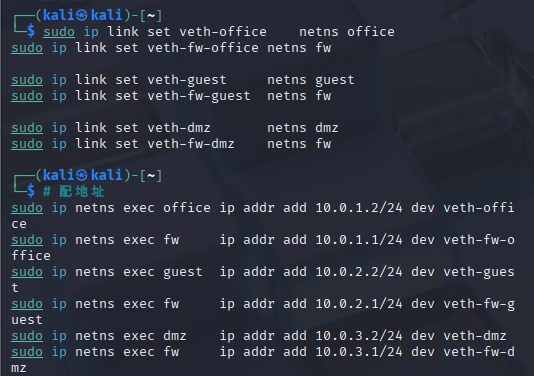
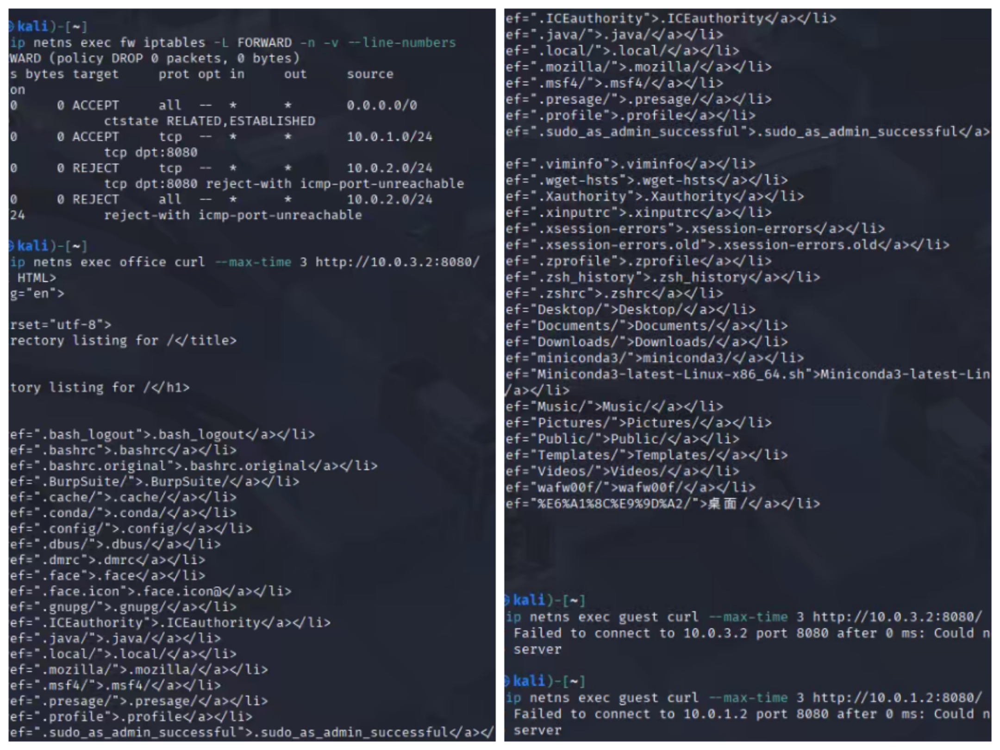
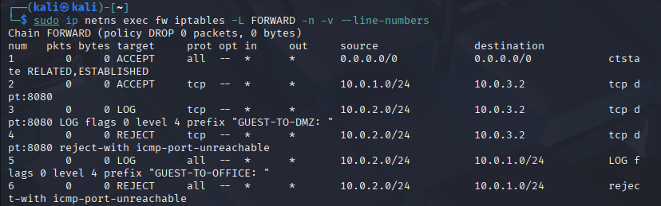
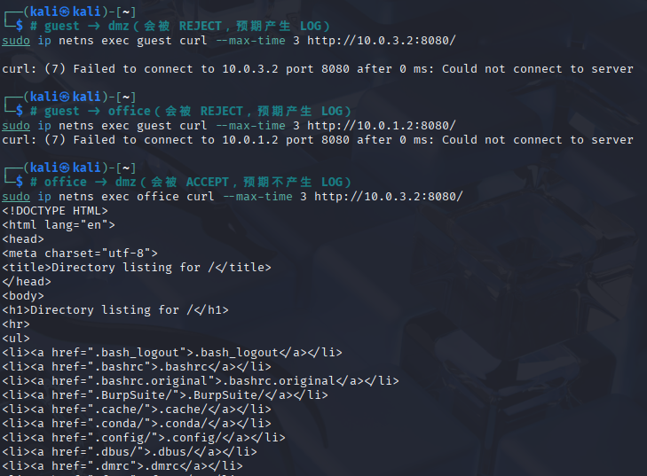
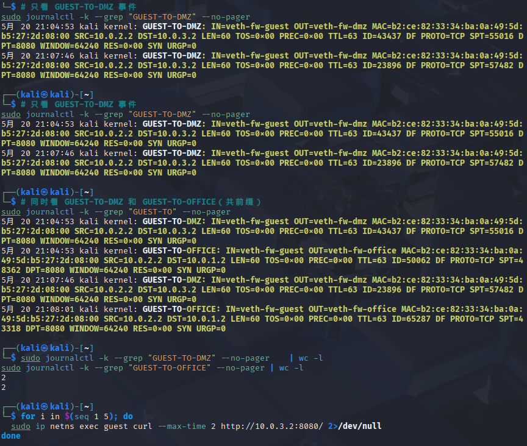
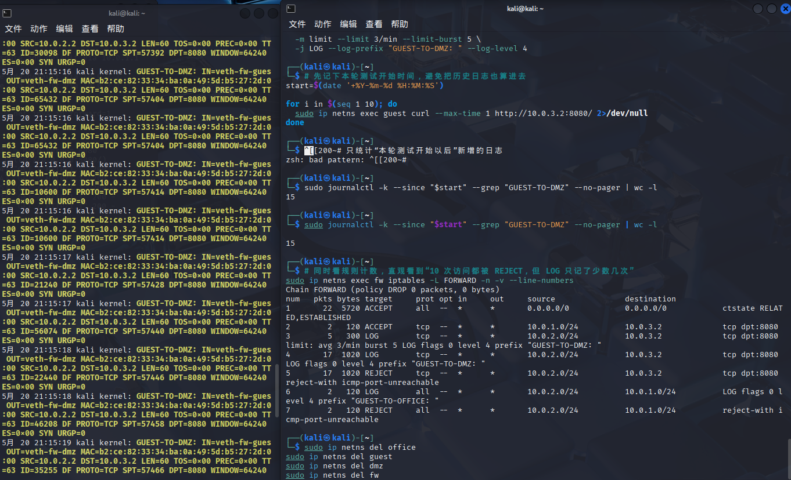

# Lab9：从访问控制到记录在案：防火墙的双重能力

## 实验背景

前面我们已经学过包结构、TCP 连接、防火墙规则和 NAT。但真实网络里，光会写几条规则还不够——有两个问题必须同时解决：

1. **分区**：主机本来就不应该混在一起。办公区、DMZ、访客区必须隔开。
2. **审计**：防火墙拦了流量，但你怎么知道有没有人在尝试跨区访问？如果没有日志，防火墙就是一个"哑巴保安"——能拦人，但不记录谁来过、什么时候来的、来了多少次。

本次实验把这两个问题**放在一起解决**，因为真实环境中的防火墙从来都是"分区 + 审计"一体化的。

实验分三个阶段，层层递进：

| 阶段 | 内容 | 核心问题 |
| :--- | :--- | :--- |
| 一 | 用 namespace 搭建网络分区，配上访问控制规则 | "谁能访问谁？" |
| 二 | 引入 LOG target，让每一次拦截都留下记录 | "谁在尝试访问谁？" |
| 三 | 用前缀过滤和速率限制管理日志 | "日志多了怎么办？" |

> **环境说明**：本实验使用 Linux `network namespace` 在一台机器上模拟 4 个区域（`office`、`guest`、`dmz`、`fw`）。
> `iptables -j LOG` 写入内核日志，用 `journalctl -k` 或 `dmesg` 读取。
> namespace 不隔离内核日志，所有 LOG 规则都写入同一份内核日志。

---

## 实验拓扑

```text
office (10.0.1.2) ----\
                       \
                        fw (10.0.1.1 / 10.0.2.1 / 10.0.3.1)
                       /  \
guest  (10.0.2.2) ---/    dmz (10.0.3.2)
```

**地址规划：**

| 区域 | 地址 |
| :--- | :--- |
| `office` | `10.0.1.2/24` |
| `fw` ↔ office | `10.0.1.1/24` |
| `guest` | `10.0.2.2/24` |
| `fw` ↔ guest | `10.0.2.1/24` |
| `dmz` | `10.0.3.2/24` |
| `fw` ↔ dmz | `10.0.3.1/24` |

**访问控制目标：**

1. `office` 可以访问 `dmz` 的 Web 服务（`10.0.3.2:8080`）
2. `guest` 不能访问 `dmz`
3. `guest` 不能访问 `office`

---

## 第一阶段：搭建网络分区

### 任务 1：创建 namespace 并组网

#### 1.1 创建 4 个 namespace

```bash
sudo ip netns add office
sudo ip netns add guest
sudo ip netns add dmz
sudo ip netns add fw
```

#### 1.2 创建 veth 对

```bash
sudo ip link add veth-office type veth peer name veth-fw-office
sudo ip link add veth-guest  type veth peer name veth-fw-guest
sudo ip link add veth-dmz    type veth peer name veth-fw-dmz
```

#### 1.3 将 veth 放入对应的 namespace

```bash
sudo ip link set veth-office    netns office
sudo ip link set veth-fw-office netns fw

sudo ip link set veth-guest     netns guest
sudo ip link set veth-fw-guest  netns fw

sudo ip link set veth-dmz       netns dmz
sudo ip link set veth-fw-dmz    netns fw
```

#### 1.4 配置 IP 地址并启用接口

```bash
# 配地址
sudo ip netns exec office ip addr add 10.0.1.2/24 dev veth-office
sudo ip netns exec fw     ip addr add 10.0.1.1/24 dev veth-fw-office
sudo ip netns exec guest  ip addr add 10.0.2.2/24 dev veth-guest
sudo ip netns exec fw     ip addr add 10.0.2.1/24 dev veth-fw-guest
sudo ip netns exec dmz    ip addr add 10.0.3.2/24 dev veth-dmz
sudo ip netns exec fw     ip addr add 10.0.3.1/24 dev veth-fw-dmz

# 启用 lo
sudo ip netns exec office ip link set lo up
sudo ip netns exec guest  ip link set lo up
sudo ip netns exec dmz    ip link set lo up
sudo ip netns exec fw     ip link set lo up

# 启用 veth
sudo ip netns exec office ip link set veth-office up
sudo ip netns exec guest  ip link set veth-guest up
sudo ip netns exec dmz    ip link set veth-dmz up
sudo ip netns exec fw     ip link set veth-fw-office up
sudo ip netns exec fw     ip link set veth-fw-guest  up
sudo ip netns exec fw     ip link set veth-fw-dmz    up
```

#### 1.5 配置默认路由

```bash
sudo ip netns exec office ip route add default via 10.0.1.1
sudo ip netns exec guest  ip route add default via 10.0.2.1
sudo ip netns exec dmz    ip route add default via 10.0.3.1
```

#### 1.6 在 fw 中开启 IP 转发

```bash
sudo ip netns exec fw sysctl -w net.ipv4.ip_forward=1
```

#### 1.7 验证连通性（此时还没有任何防火墙规则）

在 `dmz` 中启动 Web 服务：

```bash
sudo ip netns exec dmz python3 -m http.server 8080
```

在另一个终端测试：

```bash
# 这两条在配规则前都应该成功（因为还没有任何拦截）
sudo ip netns exec office curl --max-time 3 http://10.0.3.2:8080/
sudo ip netns exec guest  curl --max-time 3 http://10.0.3.2:8080/
```

> 保持 `dmz` 中的 `python3 -m http.server 8080` 持续运行，后续测试都要用到。

---

### 任务 2：配置访问控制规则（无日志版本）

现在在 `fw` 中设置 iptables 规则，实现访问控制目标。

```bash
sudo ip netns exec fw iptables -F
sudo ip netns exec fw iptables -P FORWARD DROP
sudo ip netns exec fw iptables -A FORWARD -m conntrack --ctstate ESTABLISHED,RELATED -j ACCEPT
sudo ip netns exec fw iptables -A FORWARD -s 10.0.1.0/24 -d 10.0.3.2 -p tcp --dport 8080 -j ACCEPT
sudo ip netns exec fw iptables -A FORWARD -s 10.0.2.0/24 -d 10.0.3.2 -p tcp --dport 8080 -j REJECT
sudo ip netns exec fw iptables -A FORWARD -s 10.0.2.0/24 -d 10.0.1.0/24 -j REJECT
```

查看规则：

```bash
sudo ip netns exec fw iptables -L FORWARD -n -v --line-numbers
```

你应该看到：

```text
num  target    prot opt source          destination
1    ACCEPT    all  --  0.0.0.0/0       0.0.0.0/0       ctstate RELATED,ESTABLISHED
2    ACCEPT    tcp  --  10.0.1.0/24     10.0.3.2        tcp dpt:8080
3    REJECT    tcp  --  10.0.2.0/24     10.0.3.2        tcp dpt:8080
4    REJECT    all  --  10.0.2.0/24     10.0.1.0/24
```

**规则解读（很重要，请理解后再继续）：**

| 行号 | 作用 | 为什么放在这个位置 |
| :--- | :--- | :--- |
| 1 | 允许已建立连接的回包通过 | 否则 TCP 三次握手永远无法完成 |
| 2 | 放行 `office -> dmz:8080` | 白名单：合法业务流量 |
| 3 | 拒绝 `guest -> dmz:8080` | 访客不能访问内部服务 |
| 4 | 拒绝 `guest -> office` | 访客不能接触办公网 |
| 默认 | 其余全部丢弃（`-P FORWARD DROP`） | 白名单模型：只放已知合法流量 |

---

### 任务 3：测试访问控制

#### 3.1 测试 `office -> dmz`（应该成功）

```bash
sudo ip netns exec office curl --max-time 3 http://10.0.3.2:8080/
```

预期：返回 HTML 目录列表。

#### 3.2 测试 `guest -> dmz`（应该被拒绝）

```bash
sudo ip netns exec guest curl --max-time 3 http://10.0.3.2:8080/
```

预期：`Connection refused` 或超时。

#### 3.3 测试 `guest -> office`（应该被拒绝）

```bash
sudo ip netns exec guest curl --max-time 3 http://10.0.1.2:8080/
```

预期：连接失败。

**填写下表：**

| 测试项 | 结果（成功/失败） | 现象描述 |
| :----- | :-------------- | :------- |
| `office -> dmz:8080` | 成功| 正常返回 HTTP 目录页面，连接建立成功|
| `guest -> dmz:8080` | 失败| 提示 Connection refused 或连接超时，请求被拒绝|
| `guest -> office` |失败 | 连接超时或 Connection refused，无法访问目标主机|

**第一阶段小结**：现在防火墙在正常工作——该放的放，该拦的拦。你可以截图 `topology.png`（地址与连通性）和 `baseline_rules.png`（规则 + 测试结果），然后我们进入第二阶段。

---

## 第二阶段：让防火墙"开口说话"

第一阶段做完了，但你发现一个问题没有？

> `guest` 访问 `dmz` 被拒绝了——但**你拿不出任何证据**证明"有人尝试过"。

如果是真实网络，安全团队需要知道：
- 谁在尝试跨区访问？（源 IP）
- 想访问什么服务？（目的端口）
- 什么时候发生的？（时间戳）
- 发生了多少次？（频次）

没有日志，这些问题全部无法回答。接下来我们给防火墙加上"眼睛"。

---

### 新工具：iptables LOG target 与内核日志

#### LOG target 是什么

`LOG` 是 iptables 的一个特殊 target。与 `ACCEPT`、`DROP`、`REJECT` 不同，**LOG 不终止规则匹配**——它把命中的包的信息写入内核日志，然后继续向后匹配下一条规则。

这意味着 LOG 必须和 DROP 或 REJECT **成对出现**：

```text
规则 N：   匹配条件 → LOG     （记录）
规则 N+1： 匹配条件 → REJECT  （拦截）
```

同一个包先命中 LOG 留下记录，再命中 REJECT 被拒绝。

#### --log-prefix：给日志打标签

```bash
iptables ... -j LOG --log-prefix "GUEST-TO-DMZ: "
```

`--log-prefix` 在日志行开头加一段固定前缀，最长 29 个字符（含末尾空格）。有了前缀，就能用 `grep` 精确过滤出某类事件。

#### 读取内核日志

`iptables -j LOG` 写入的是 Linux **内核日志**。两种常用读法：

| 命令 | 适用场景 | 关键参数 |
| :--- | :--- | :--- |
| `sudo journalctl -k -f` | systemd 系统（推荐） | `-k`=只看内核日志，`-f`=实时追踪 |
| `sudo dmesg -w` | 无 systemd 或更简单环境 | `-w`=实时显示新消息 |

加过滤：

```bash
sudo journalctl -k -f --grep "GUEST-TO-DMZ"    # journalctl 方式
sudo dmesg -w | grep "GUEST-TO-DMZ"            # dmesg 方式
```

#### 一行日志长什么样

```text
[12345.678901] GUEST-TO-DMZ: IN=veth-fw-guest OUT=veth-fw-dmz
  MAC=... SRC=10.0.2.2 DST=10.0.3.2 LEN=60 TOS=0x00
  PROTO=TCP SPT=54321 DPT=8080 FLAGS=SYN
```

| 字段 | 含义 |
| :--- | :--- |
| `[12345.678]` | 系统启动后的秒数（内核时间戳） |
| `GUEST-TO-DMZ:` | 你设置的 `--log-prefix` |
| `IN=` | 包从哪个接口进入 |
| `OUT=` | 包将从哪个接口转发出去 |
| `MAC=` | 二层头信息，通常能看到源/目的 MAC；排查链路方向时有帮助 |
| `SRC=` | 源 IP 地址 |
| `DST=` | 目的 IP 地址 |
| `LEN=` | IP 包总长度（字节） |
| `TOS=` | Type of Service / DSCP 相关字段，表示服务质量标记 |
| `PREC=` | 旧式优先级字段，现代环境中通常是 `0x00` |
| `TTL=` | 生存时间，每经过一跳会减 1，可辅助判断路径长度 |
| `ID=` | IP 分片标识，同一报文分片后通常共享同一个 ID |
| `DF` | Don't Fragment 标志，表示该包不允许被分片 |
| `PROTO=` | 协议（TCP / UDP / ICMP） |
| `SPT=` | 源端口 |
| `DPT=` | 目的端口 |
| `WINDOW=` | TCP 窗口大小，表示接收端当前可接受的数据量 |
| `RES=` | TCP 头中的保留位，通常为 `0x00` |
| `SYN` / `ACK` / `FIN` / `RST` | TCP 标志位；`SYN` 常表示新连接请求，`RST` 常表示异常中断或拒绝 |
| `URGP=` | TCP 紧急指针，通常为 0 |

看到一行日志时，最值得先读的通常是这几组字段：

1. `GUEST-TO-DMZ:`：这是谁触发的哪一类规则。
2. `IN=` 和 `OUT=`：包是从哪个区域进、准备往哪个区域去。
3. `SRC=` 和 `DST=`：是谁访问谁。
4. `PROTO=`、`SPT=`、`DPT=`：访问的是哪种协议、从哪个源端口发起、目标服务端口是多少。
5. `SYN`/`ACK`/`RST`：这是新连接、已建立连接中的报文，还是异常/拒绝相关报文。

---

### 任务 4：为拦截规则加上 LOG

现在把第一阶段中两条 REJECT 规则改造成"先 LOG，再 REJECT"的形式。

#### 4.1 清空现有规则，保留默认策略

```bash
sudo ip netns exec fw iptables -F
sudo ip netns exec fw iptables -P FORWARD DROP
```

#### 4.2 加回放行规则（不变）

```bash
sudo ip netns exec fw iptables -A FORWARD -m conntrack --ctstate ESTABLISHED,RELATED -j ACCEPT
sudo ip netns exec fw iptables -A FORWARD -s 10.0.1.0/24 -d 10.0.3.2 -p tcp --dport 8080 -j ACCEPT
```

#### 4.3 将 `guest -> dmz` 改造成 LOG + REJECT

```bash
# 先 LOG
sudo ip netns exec fw iptables -A FORWARD \
  -s 10.0.2.0/24 -d 10.0.3.2 -p tcp --dport 8080 \
  -j LOG --log-prefix "GUEST-TO-DMZ: " --log-level 4

# 再 REJECT
sudo ip netns exec fw iptables -A FORWARD \
  -s 10.0.2.0/24 -d 10.0.3.2 -p tcp --dport 8080 \
  -j REJECT
```

**关键点**：LOG 和 REJECT 的匹配条件完全相同，LOG 必须排在 REJECT 前面。

#### 4.4 将 `guest -> office` 也改造成 LOG + REJECT

```bash
sudo ip netns exec fw iptables -A FORWARD \
  -s 10.0.2.0/24 -d 10.0.1.0/24 \
  -j LOG --log-prefix "GUEST-TO-OFFICE: " --log-level 4

sudo ip netns exec fw iptables -A FORWARD \
  -s 10.0.2.0/24 -d 10.0.1.0/24 \
  -j REJECT
```

#### 4.5 查看完整规则

```bash
sudo ip netns exec fw iptables -L FORWARD -n -v --line-numbers
```

预期输出：

```text
num  target    prot opt source          destination
1    ACCEPT    all  --  0.0.0.0/0       0.0.0.0/0       ctstate RELATED,ESTABLISHED
2    ACCEPT    tcp  --  10.0.1.0/24     10.0.3.2        tcp dpt:8080
3    LOG       tcp  --  10.0.2.0/24     10.0.3.2        tcp dpt:8080  LOG flags 0 ... prefix "GUEST-TO-DMZ: "
4    REJECT    tcp  --  10.0.2.0/24     10.0.3.2        tcp dpt:8080  reject-with icmp-port-unreachable
5    LOG       all  --  10.0.2.0/24     10.0.1.0/24     LOG flags 0 ... prefix "GUEST-TO-OFFICE: "
6    REJECT    all  --  10.0.2.0/24     10.0.1.0/24     reject-with icmp-port-unreachable
```

**填写下表：**

| 项目 | 你的填写 |
| :--- | :------- |
| LOG 规则条数 | 2|
| REJECT 规则条数 | 2|
| `GUEST-TO-DMZ:` LOG 位于第几行 |3 |
| 对应的 REJECT 位于第几行 | 4|
| LOG 与 REJECT 的匹配条件是否完全一致 | 是|

**简答：**

1. 如果把 LOG 放在 REJECT 之后，LOG 规则还会被命中吗？为什么？

> 答：不会命中。因为 REJECT 会终止规则匹配流程，包不会继续走到后面的 LOG 规则。

---

### 任务 5：触发日志并实时观察

#### 5.0 如果规则命中了但看不到日志，先处理这个常见问题

在 Ubuntu 24.04 这类使用 `iptables-nft` 的环境中，如果你已经确认 `LOG` 规则命中计数在增长，但 `journalctl -k` 和 `dmesg` 仍然看不到任何 `GUEST-TO-*` 日志，通常是因为内核默认不记录来自非初始 network namespace 的 netfilter LOG。

先在**宿主机**执行：

```bash
sudo sysctl -w net.netfilter.nf_log_all_netns=1
```

然后重新触发一次 `guest` 的违规访问，再观察日志。这个开关要在宿主机设置，不是在 `fw` namespace 里设置。

#### 5.1 打开日志监视（终端 D）

```bash
# 推荐
sudo journalctl -k -f

# 或
sudo dmesg -w
```

保持这个终端持续运行，切换到另一个终端（终端 B）触发访问。

#### 5.2 触发 guest 的违规访问

在终端 B 分别执行：

```bash
# guest -> dmz（会被 REJECT，预期产生 LOG）
sudo ip netns exec guest curl --max-time 3 http://10.0.3.2:8080/

# guest -> office（会被 REJECT，预期产生 LOG）
sudo ip netns exec guest curl --max-time 3 http://10.0.1.2:8080/

# office -> dmz（会被 ACCEPT，预期不产生 LOG）
sudo ip netns exec office curl --max-time 3 http://10.0.3.2:8080/
```

每次执行后立刻切回终端 D，观察内核日志的变化。

#### 5.3 填写下表

| 测试 | 访问结果 | 是否出现 LOG | 日志前缀 |
| :--- | :------- | :---------- | :------- |
| `guest -> dmz:8080` |失败 | 是|GUEST-TO-DMZ: |
| `guest -> office` |失败 | 是|GUEST-TO-OFFICE: |
| `office -> dmz:8080` |成功 | 否|无 |

**从终端 D 复制一条实际日志行：**

```text
5月 20 21:04:53 kali kernel: GUEST-TO-OFFICE: IN=veth-fw-guest OUT=veth-fw-office MAC=b2:ce:82:33:34:ba:0a:49:5d:b5:27:2d:08:00 SRC=10.0.2.2 DST=10.0.1.2 LEN=60 TOS=0x00 PREC=0x00 TTL=63 ID=50062 DF PROTO=TCP SPT=48362 DPT=8080 WINDOW=64240 RES=0x00 SYN URGP=0    
```

**简答：**

1. `office -> dmz` 成功了但没有日志，这合理吗？如果想记录"所有被放行的流量"，应该怎么做？

> 答：合理。因为我们只给 REJECT 拦截规则配了 LOG，没有给 ACCEPT 放行规则配 LOG。如果要记录所有被放行的流量，需要在对应 ACCEPT 规则前加上相同条件的 LOG 规则。

2. 从日志里你能读出什么信息？"谁在访问谁的什么服务"能还原出来吗？

> 答：能读出源 IP、目的 IP、协议、源端口、目的端口、进入 / 流出网卡、TCP 标志位等信息。可以完整还原出谁（SRC）在访问谁（DST）的什么服务（DPT / 协议），审计信息完整。

---

### 任务 6：用前缀过滤日志

内核日志里不只有 iptables 的消息，还有各种驱动、硬件事件。如果不过滤，想在嘈杂的输出中找到防火墙日志会很困难。

#### 6.1 按前缀精确过滤

```bash
# 只看 GUEST-TO-DMZ 事件
sudo journalctl -k --grep "GUEST-TO-DMZ" --no-pager

# dmesg 方式
sudo dmesg | grep "GUEST-TO-DMZ"
```

#### 6.2 按前缀模糊匹配

```bash
# 同时看 GUEST-TO-DMZ 和 GUEST-TO-OFFICE（共前缀）
sudo journalctl -k --grep "GUEST-TO" --no-pager
```

#### 6.3 统计每类事件各发生多少次

```bash
sudo journalctl -k --grep "GUEST-TO-DMZ" --no-pager    | wc -l
sudo journalctl -k --grep "GUEST-TO-OFFICE" --no-pager | wc -l
```

#### 6.4 循环多次触发，验证计数增长

```bash
for i in $(seq 1 5); do
  sudo ip netns exec guest curl --max-time 2 http://10.0.3.2:8080/ 2>/dev/null
done
```

再次统计，确认条数增加了 5。

**填写下表：**

| 项目 | 你的填写 |
| :--- | :------- |
| `GUEST-TO-DMZ` 总日志条数 | 2|
| `GUEST-TO-OFFICE` 总日志条数 |2 |
| 循环 5 次后 `GUEST-TO-DMZ` 增加了多少 |4 |
| 你使用的过滤命令 |sudo journalctl -k --grep "GUEST-TO" --no-pager |

**简答：**

1. `--log-prefix` + `grep` 组合，相当于给不同事件打了不同"标签"。在真实场景中这有什么实际价值？

> 答：可以快速分类、筛选、统计不同类型的防火墙事件，方便安全审计、故障排查、攻击溯源和告警监控，大幅提升日志处理效率。

2. 如果防火墙每秒拦截上千个包，不加限制地写 LOG 会有什么后果？

> 答：会导致日志暴增、占用大量磁盘空间、消耗系统 CPU 与 I/O 资源，严重时可能影响防火墙性能，甚至造成日志丢失、系统卡顿。

---

## 第三阶段：日志速率控制

### 任务 7：用 --limit 限制日志写入频率

如果每秒有大量同类包被拦截（比如遭遇扫描攻击），不加限制的 LOG 会让日志系统不堪重负，甚至影响系统性能。`-m limit` 模块可以限制每条规则的日志写入频率。

#### 7.1 删除原来的 `GUEST-TO-DMZ` LOG 规则

```bash
# 先查行号
sudo ip netns exec fw iptables -L FORWARD -n --line-numbers

# 按行号删除 GUEST-TO-DMZ 的 LOG 规则
sudo ip netns exec fw iptables -D FORWARD <行号>
```

#### 7.2 插入带速率限制的 LOG 规则

```bash
sudo ip netns exec fw iptables -I FORWARD 3 \
  -s 10.0.2.0/24 -d 10.0.3.2 -p tcp --dport 8080 \
  -m limit --limit 3/min --limit-burst 5 \
  -j LOG --log-prefix "GUEST-TO-DMZ: " --log-level 4
```

| 参数 | 含义 |
| :--- | :--- |
| `-I FORWARD 3` | 插入到第 3 行，保持在 REJECT 规则之前 |
| `-m limit` | 使用 `limit` 模块进行速率匹配 |
| `--limit 3/min` | 稳定状态下每分钟最多写 3 条日志 |
| `--limit-burst 5` | 允许初始突发最多 5 条，之后降到 `--limit` 速率 |

#### 7.3 快速触发 10 次访问

```bash
# 先记下本轮测试开始时间，避免把历史日志也算进去
start=$(date '+%Y-%m-%d %H:%M:%S')

for i in $(seq 1 10); do
  sudo ip netns exec guest curl --max-time 1 http://10.0.3.2:8080/ 2>/dev/null
done
```

#### 7.4 统计实际产生的日志条数

```bash
# 只统计“本轮测试开始以后”新增的日志
sudo journalctl -k --since "$start" --grep "GUEST-TO-DMZ" --no-pager | wc -l

# 同时看规则计数，直观看到“10 次访问都被 REJECT，但 LOG 只记了少数几次”
sudo ip netns exec fw iptables -L FORWARD -n -v --line-numbers
```

**关键观察**：

1. `guest -> dmz` 的 10 次访问仍然都会失败，说明后面的 `REJECT` 对每次访问都生效。
2. `journalctl --since "$start" ... | wc -l` 统计到的新增日志条数不超过 `--limit-burst` 的值（5 条）。
3. `iptables -L FORWARD -n -v` 中第 4 条 `REJECT` 的命中次数会明显大于第 3 条 `LOG` 的命中次数，这就是 `limit` 生效的直接证据。

如果你想把这个现象看得更清楚，可以连续执行两次下面的对照命令：

```bash
sudo journalctl -k --since "$start" --grep "GUEST-TO-DMZ" --no-pager
sudo ip netns exec fw iptables -L FORWARD -n -v --line-numbers
```

你应该能看到：日志行数最多只有 5 条，但 `REJECT` 规则已经处理了 10 次访问。

#### 7.5 填写下表

| 项目 | 你的填写 |
| :--- | :------- |
| 触发访问次数 | 10 |
| 实际写入日志条数 | 4|
| `--limit-burst 5` 的含义 |允许初始突发最多记录 5 条，之后按限速记录 |
| 未记录的访问是否仍然被 REJECT |是 |

**简答：**

1. `--limit` 只控制了 LOG 的写入频率，但后面的 REJECT 仍对每个包生效。这说明 LOG 和 REJECT 在逻辑上是什么关系？

> 答：LOG 只负责记录，不影响拦截；REJECT 负责拦截，两者独立生效。

2. "没记录就当没发生"和"仍然拦截但不记录"有本质区别吗？为什么安全审计中这个区别很重要？

> 答：有本质区别。仍然拦截但不记录是安全控制有效，只是日志采样；不记录就当没发生等于失去审计依据，无法追责与溯源。

---

### 任务 8：清理

实验结束后清理所有 namespace：

```bash
sudo ip netns del office
sudo ip netns del guest
sudo ip netns del dmz
sudo ip netns del fw

# 确认清理完毕
sudo ip netns list
```

输出为空即完成。

---

## 实验结果填写

### A. 环境搭建

| 项目 | 你的填写 |
| :--- | :------- |
| `office` 地址 |10.0.1.2/24 |
| `guest` 地址 |10.0.2.2/24 |
| `dmz` 地址 | 10.0.3.2/24|
| `fw` 三个接口地址 |10.0.1.1/24、10.0.2.1/24、10.0.3.1/24 |



---

### B. 第一阶段：访问控制规则（无日志）

| 规则作用 | 你的规则 |
| :------- | :------- |
| 默认转发策略 |iptables -P FORWARD DROP |
| 允许已建立连接返回 | iptables -A FORWARD -m conntrack --ctstate ESTABLISHED,RELATED -j ACCEPT|
| 允许 `office -> dmz:8080` |iptables -A FORWARD -s 10.0.1.0/24 -d 10.0.3.2 -p tcp --dport 8080 -j ACCEPT |
| 拒绝 `guest -> dmz:8080` | iptables -A FORWARD -s 10.0.2.0/24 -d 10.0.3.2 -p tcp --dport 8080 -j REJECT|
| 拒绝 `guest -> office` |iptables -A FORWARD -s 10.0.2.0/24 -d 10.0.1.0/24 -j REJECT |

| 测试项 | 结果 |
| :----- | :--- |
| `office -> dmz:8080` |成功 |
| `guest -> dmz:8080` |失败 |
| `guest -> office` |失败 |



---

### C. 第二阶段：带日志的规则

| 规则行号 | target | 匹配条件 | 前缀（如有） |
| :------- | :----- | :------- | :---------- |
| 1 |ACCEPT |ctstate RELATED,ESTABLISHED | 无|
| 2 |ACCEPT|-s 10.0.1.0/24 -d 10.0.3.2 tcp dpt:8080 |无 |
| 3 |LOG |-s 10.0.2.0/24 -d 10.0.3.2 tcp dpt:8080 | GUEST-TO-DMZ:|
| 4 |REJECT |-s 10.0.2.0/24 -d 10.0.3.2 tcp dpt:8080 | 无|
| 5 |LOG |-s 10.0.2.0/24 -d 10.0.1.0/24 |GUEST-TO-OFFICE: |
| 6 |REJECT |-s 10.0.2.0/24 -d 10.0.1.0/24 | 无|

| 测试 | 访问结果 | 是否出现 LOG | 日志前缀 |
| :--- | :------- | :---------- | :------- |
| `guest -> dmz:8080` | 失败|是 |GUEST-TO-DMZ: |
| `guest -> office` |失败 |是 |GUEST-TO-OFFICE: |
| `office -> dmz:8080` |成功 |否 |无 |





---

### D. 日志过滤与速率控制

| 项目 | 你的填写 |
| :--- | :------- |
| `GUEST-TO-DMZ` 总条数 | 2|
| `GUEST-TO-OFFICE` 总条数 | 2|
| 过滤命令 |journalctl -k --grep "GUEST-TO" --no-pager |
| 加 `--limit` 后触发 10 次，日志条数 |4 |





---

## 思考题

1. 为什么 `dmz` 的服务不应该和 `office` 混在同一个网段？用本实验的规则效果来说明。

   > 答：DMZ 是对外开放区域，Office 是内部可信区域。混在同一网段会失去网络边界，无法用防火墙做分区隔离与访问控制。本实验中通过不同网段与 iptables 规则实现 Office 可访问 DMZ、Guest 禁止访问 DMZ/Office，一旦同网段，这些分区控制将全部失效，外部攻击可直接渗透内网。

2. 为什么 `guest` 一般应该和办公网隔离？

   > 答：Guest 属于不可信区域，访客设备可能存在病毒、木马或被入侵。隔离可以阻止横向渗透，防止访客设备扫描、攻击、窃取办公网数据，保障内网安全。

3. 第一阶段中为什么必须保留 `ESTABLISHED,RELATED` 规则？如果去掉会怎样？

   > 答：该规则允许已建立连接的响应报文通过。去掉后，TCP 三次握手的回包会被默认策略 DROP，所有 TCP 连接无法建立，Office 访问 DMZ 也会失败，业务完全不通。

4. `LOG` target 和 `ACCEPT`/`DROP`/`REJECT` 最本质的区别是什么？为什么 LOG 必须放在 REJECT 前面？

   > 答：LOG 只记录日志，不终止匹配流程；ACCEPT/DROP/REJECT 会终止匹配并执行动作。LOG 必须在前，因为 REJECT 会直接丢弃 / 拒绝报文，若放在后面，报文不会再走到 LOG 规则，无法记录。

5. `office -> dmz` 的成功访问没有日志，被拦截的 `guest` 访问有日志。这是合理的还是疏漏？为什么？

   > 答：合理。安全审计优先记录违规、拦截、异常行为，放行流量属于正常业务，可按需开启日志。本实验只给拦截规则加 LOG，符合最小日志与安全优先原则。

6. `--limit` 控制日志频率后，超出限制的包仍然被 REJECT 但不再写入日志。这和"只要不记录就当没发生"有本质区别吗？

   > 答：有本质区别。限流只是日志采样，拦截动作始终生效，安全防护没有失效；“不记录当没发生” 等于放弃审计与溯源，无法证明攻击被拦截，不符合安全合规要求。

7. 如果后面要接入 VPN，你认为 VPN 用户应该先接入哪个区域？结合网络分区和日志审计两个角度回答。

   > 答：应先接入独立的 VPN 隔离区 / 访客区。网络分区上，可统一控制 VPN 用户权限，避免直接进入内网；日志审计上，所有 VPN 访问行为可集中记录、过滤、统计，便于审计、告警与溯源。

---

## 截图要求

- 截图须清晰，终端文字可读。
- 所有截图与本 `Lab9.md` 放在**同一目录**下。

| 截图内容 | 文件名 | 对应阶段 |
| :------- | :----- | :------- |
| 地址与接口配置、连通性验证 | `topology.png` | 任务 1 |
| 无日志版规则 + 三种访问测试结果 | `baseline_test.png` | 任务 2-3 |
| 带 LOG 的完整规则列表 | `log_rules.png` | 任务 4 |
| 实时日志观察（含完整 LOG 行） | `realtime_log.png` | 任务 5 |
| 日志过滤与统计（grep + wc -l） | `log_filter.png` | 任务 6 |
| 速率限制效果（10 次触发，日志远少于 10） | `log_limit.png` | 任务 7 |

**各截图具体要求：**

1. `topology.png`：能看到 namespace 列表、地址配置或 `ip route` 输出。
2. `baseline_test.png`：能看到规则列表 + 三种访问的测试结果（无需 LOG）。
3. `log_rules.png`：能看到 LOG 与 REJECT 成对出现，前缀清晰可辨。
4. `realtime_log.png`：能看到至少一条完整 LOG 行，含 `SRC=`、`DST=`、`DPT=` 等字段。
5. `log_filter.png`：能看到 `grep`/`--grep` 过滤命令及其输出，以及 `wc -l` 统计结果。
6. `log_limit.png`：能看到触发 10 次但日志条数不超过 `--limit-burst`（5 条）的现象。

---

## 提交要求

在自己的文件夹下新建 `Lab9/` 目录，提交以下文件：

```text
学号姓名/
└── Lab9/
    ├── Lab9.md          # 本文件（填写完整，含截图与答案）
    ├── topology.png
    ├── baseline_test.png
    ├── log_rules.png
    ├── realtime_log.png
    ├── log_filter.png
    └── log_limit.png
```

---

## 截止时间

2026-05-28，届时关于 Lab9 的 PR 将不会被合并。

